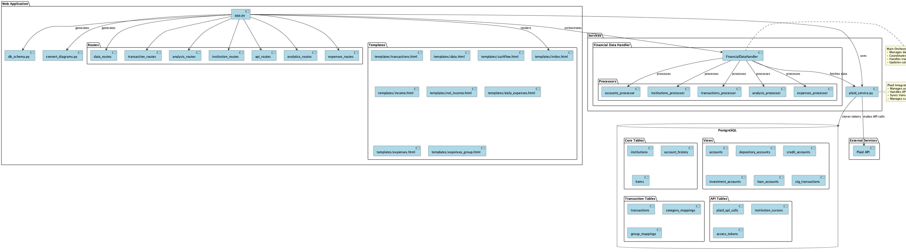
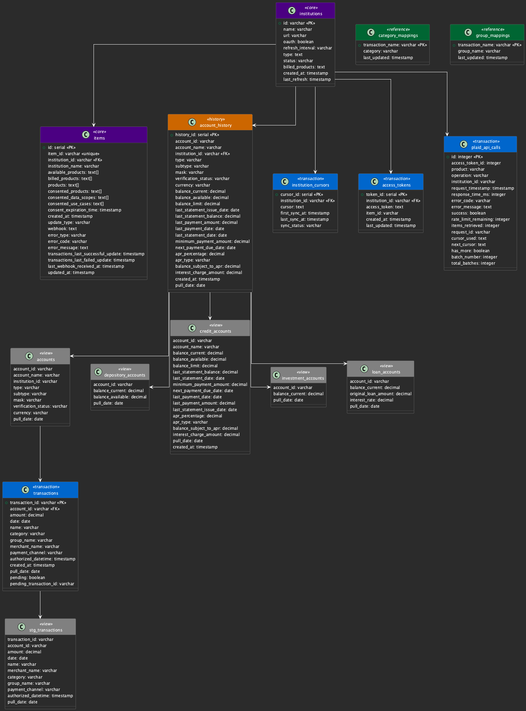

# Financial Data Fetcher

A Flask-based application that integrates with Plaid API to fetch, process, analyze, and visualize financial data across multiple institutions.

## Overview

This application serves as a comprehensive financial data management system that:
- Connects to multiple banking institutions via Plaid
- Automatically syncs and categorizes transactions
- Provides detailed financial analysis and visualizations
- Maintains historical financial records in a PostgreSQL database
- Offers real-time database statistics and monitoring

## Technical Architecture

### Key Components
1. **Web Application Layer**
   - Flask backend with modular routing system
   - Interactive frontend with real-time updates
   - Dynamic database schema visualization
   - Comprehensive error handling and loading states

2. **Analytics Layer**
   - Cash flow analysis
   - Income tracking and analysis
   - Net income calculations
   - Daily expense monitoring
   - Group-based expense categorization

3. **Services Layer**
   - Plaid API integration
   - Financial data processing pipeline
   - Transaction categorization system
   - Institution metadata management

4. **Storage Layer**
   - PostgreSQL database with views and materialized tables
   - API call tracking and monitoring
   - Cursor-based transaction syncing
   - Token management system

### Database Schema
The application uses a sophisticated database design with:
- Core tables (institutions, account_history)
- View tables (accounts, account type views)
- Transaction tables & views
- API tracking (plaid_api_calls)
- Authentication (access_tokens)
- Reference tables (category_mappings, group_mappings)

## Setup

### Docker Setup
1. Build and run using Docker Compose:
```bash
docker compose up --build
```

2. For development with live reload:
```bash
docker compose up --build -d
docker compose logs -f
```

3. To rebuild from scratch (including database):
```bash
docker compose down -v
docker compose up --build
```

### Docker Container Structure
- `web`: Flask application container
  - Python 3.9-slim base image
  - Auto-reloading in development mode
  - Exposed on port 8000
  - Volume mounted for live code updates
- `db`: PostgreSQL database container
  - PostgreSQL 13
  - Persistent volume for data storage
  - Exposed on port 5432
  - Automatic schema initialization via init.sql

### Environment Variables
Required environment variables in `.env`:
```bash
# Database Configuration
DB_NAME=your_db_name
DB_USER=your_db_user
DB_PASSWORD=your_db_password
DB_PORT=5432

# Plaid API Configuration
PLAID_CLIENT_ID=your_client_id
PLAID_SECRET=your_secret
PLAID_ENV=sandbox
PLAID_WEBHOOK_SECRET=your_webhook_secret

# Application Configuration
APP_URL=your_app_url
FLASK_APP=app.app
FLASK_ENV=development
```

### Manual Setup
1. Configure PostgreSQL database
2. Copy `.env.example` to `.env` and configure:
   - Plaid API credentials
   - Database connection details
   - Environment settings
   - Webhook configurations

## System Architecture

### Detailed Component Diagram


### Database Schema


## Technologies Used
- Backend: Python/Flask
- Database: PostgreSQL
- Frontend: HTML/CSS/JavaScript/jQuery
- API Integration: Plaid API
- Visualization: PlantUML for diagrams
- Monitoring: Custom API tracking system

## Features
- Multi-institution support
- Real-time financial data syncing
- Comprehensive financial analysis
- Transaction categorization
- Group-based expense tracking
- Database statistics monitoring
- Schema visualization
- Historical data tracking

## Future Enhancements
- Machine learning for transaction categorization
- Advanced financial forecasting
- API performance optimization
- Enhanced error recovery mechanisms
- Extended analytics capabilities
